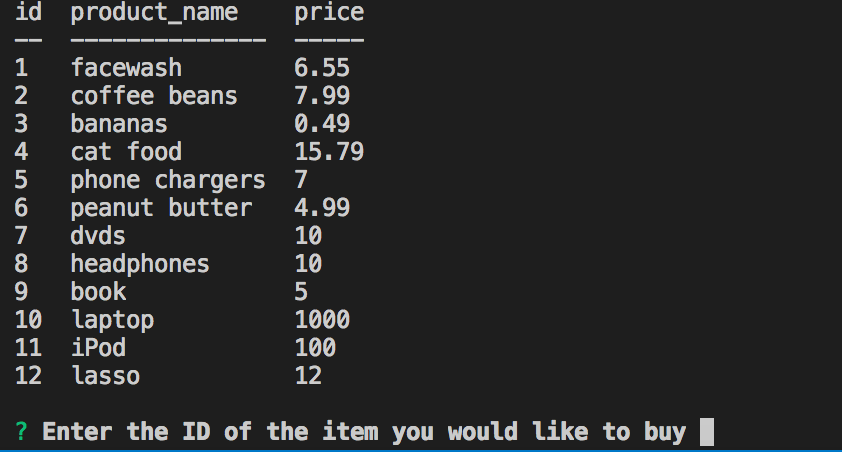
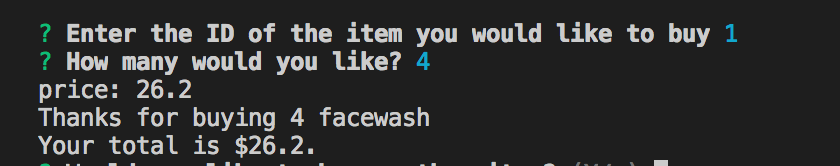

# Bamazon

Bamazon is an application made by me, Hayley Hartman, in October 2018. Bamazon is a command line node app that returns information to the user based on the command entered. Users using the customer side of the app can view items in the bamazon store, choose how many to buy, see their total, and then choose to exit or buy more items. Users using the manager side of the app can view products for sale, view low-inventory products, add to inventory, or add a new product.

### Technology

This application uses javascript, NPM, MySql

### How to use

1. Clone this repository to your computer
2. Enter your local copy of this repository
3. Run npm install
4. Open this repository in Visual Studio Code (or whatever editor you use)
5. Run the sql.sql file to give you a local copy of the tables bamazon works on
6. Run node customer or node manager to interact with bamazon

### Customer view

Customers can use Bamazon to view products, then by entering the ID and the quantity they would like, they can purchase the product.

### Manager view

Managers can use Bamazon to complete an array of options within their store.

##### View products

##### View low inventory

##### Add inventory to existing products

##### Add new products

